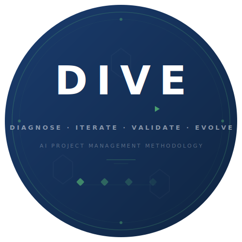

# DIVE Framework™

<p align="center">
  
</p>

> **Diagnose → Iterate → Validate → Evolve**
>
> A project management methodology purpose-built for Artificial Intelligence and Machine Learning initiatives.

[](https://creativecommons.org/licenses/by-nd/4.0/)


---

## What Is DIVE?

Traditional project management frameworks (PMBOK, PRINCE2, Agile) assume deterministic outputs and known solution paths. AI projects are different — they are probabilistic, data-dependent, and degrade continuously after deployment.

**DIVE** replaces false certainty with structured exploration:
- **Data-first** — no code until data feasibility is proven
- **Parallel exploration** — multiple approaches, fixed compute budgets
- **Metric Contracts** — measurable success criteria, signed before start
- **Continuous governance** — models monitored for their entire lifetime

---

## The 7 Principles

| # | Principle | What It Replaces |
|---|-----------|-----------------|
| 1 | **Data First, Code Second** | Requirements documents |
| 2 | **Parallel Exploration** | Single-track development |
| 3 | **Metric Contracts** | Narrative specifications |
| 4 | **Fail Fast, Fail Quantitatively** | Subjective "one more iteration" |
| 5 | **Continuous Governance** | Handoff-and-forget |
| 6 | **Human-in-the-Loop by Design** | Retrospective safety fixes |
| 7 | **Compute as First-Class Resource** | Ignored operational cost |

---

## Lifecycle

```
┌─────────────────────────────────────────────────────────────┐
│  Diagnose  ──►  Iterate  ──►  Validate  ──►  Evolve        │
│  (2-4 wks)     (4-8 wks)     (2-4 wks)     (ongoing)       │
└─────────────────────────────────────────────────────────────┘
```

- **Diagnose:** Data audit, feasibility baseline, Metric Contract, ethics screening
- **Iterate:** 3-5 parallel experiment tracks, compute budget tracking
- **Validate:** Hold-out evaluation, bias audit, robustness testing, stakeholder sign-off
- **Evolve:** Deployment, drift monitoring, retraining, governance reviews

---

## Repository Structure

```
├── README.md                    # This file
├── LICENSE                      # CC BY-ND 4.0
├── framework-reference.md       # Complete methodology (principles + lifecycle)
├── DIVE-Implementation-Guide.html # Interactive implementation guide
├── DIVE-One-Pager.html / .pdf   # Single-page visual summary
├── DIVE-Presentation.pptx       # Slide deck
├── DIVE-White-Paper.pdf         # Academic white paper (SSRN: 6806018)
└── assets/
    ├── DIVE-Logo.svg
    └── DIVE-Logo-Horizontal.svg
```

---

## Getting Started

1. **Read the framework** — start with `framework-reference.md`
2. **Explore the interactive guide** — open `DIVE-Implementation-Guide.html` for phase walkthroughs, diagrams, and checklist
3. **Download the slide deck** — `DIVE-Presentation.pptx` for team onboarding
4. **Read the white paper** — `DIVE-White-Paper.pdf` or SSRN Abstract ID: 6806018

---

## License

This work is licensed under [CC BY-ND 4.0](https://creativecommons.org/licenses/by-nd/4.0/). You are free to share and use it, provided you give appropriate attribution. No derivatives without permission.

**DIVE Framework™** is a trademark of Vahid Hakami.

---

## Citation

If you reference this framework in academic or professional work:

> Vahid Hakami. (2026). *DIVE: A Project Management Framework for Artificial Intelligence Initiatives*. SSRN Abstract ID: 6806018. Available: https://papers.ssrn.com/sol3/papers.cfm?abstract_id=6806018

---

## Contact

Vahid Hakami — vd.hakami@gmail.com — https://uk.linkedin.com/in/vahidhakami
